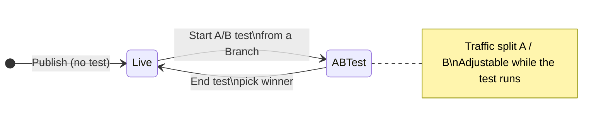

<Note>
**Availability (Beta).** A/B testing is available on US and UK enterprise clusters behind a feature flag. Ask your PolyAI representative to enable it for your project.
</Note>

A/B tests publish a second version to Live alongside the current one and split real caller traffic between them. You compare key metrics in your dashboards before ending the test and picking a winner to receive 100% of traffic.

Use it for any change where you want evidence before fully rolling out: a new prompt, a reworked flow, a different routing rule, a model swap. Until now every change went to 100% of traffic when you published; A/B testing gives you a controlled rollout.

## How it works

- The **current Live version** is the **control (A)**. The **Branch you publish as an A/B test** is the **variant (B)**.
- At test start you set a traffic split between A and B (between 5% / 95% and 95% / 5%, in 5% steps; defaults to 50 / 50).
- Both versions handle real customer traffic. Calls are routed at the start of the conversation and stay on the assigned version for the whole call.
- You can change the split while the test runs. Open **Edit A/B test** on the active test in Live history.
- Only one A/B test can be active per project at a time.
- You end the test by picking a winner. The chosen version receives 100% of live traffic. The other version stops receiving traffic. If the control loses, it stays in Live history. If the variant loses, it stays available as a Branch.

## Before you start

You need:

- An active Live deployment (this becomes the control).
- A Branch that you want to test against it (this becomes the variant). It must be synced with Live. Any Branch can start a test, whether it is in Sandbox or Staging. Create it with the standard [Branches flow](/environments-and-versions/branches-mode#making-a-change).
- No other A/B test currently running on the project.
- The `ab_tests` feature flag enabled for the project.

You also need write access to environments. Run [simulation tests](/testing/simulation-tests) on the variant Branch before you start the test. A/B testing measures real-world performance, not correctness.

## Start a test

1. Open the Branch you want to test as the variant.
2. Open the **Publish** menu (top-right) and select **Publish as an A/B test**. The option is greyed out until the Branch is synced with Live.

<Frame caption="The Publish menu on a Branch, with Publish as an A/B test below Publish">
  
</Frame>

3. In the **Start A/B test** modal:
   - **Name**: defaults to the current date and time. Override with something you'll recognize in history (for example, `Refund flow rewrite`).
   - **Traffic split**: use the slider to set the split between A (control, the current Live version) and B (variant, your Branch). Steps of 5%, from 5/95 to 95/5.
   - Review both version cards to confirm you're testing the right deployments.
4. Tick **Please confirm both versions will start receiving live customer traffic** and click **Start test**.

Both versions now serve live traffic at the configured split. **Live history** on the Deployments page groups them together under the test name with **Live A** and **Live B** tags showing each version's traffic share.

<Warning>
**Both versions are live.** Once you start the test, every caller is routed to either A or B and receives a real, production interaction. Don't start a test with a variant you wouldn't be comfortable shipping to all customers if it had to.
</Warning>

## While a test is running

- The active test appears as a group in **Live history** on the Deployments page, with each version's traffic share shown next to it (for example, *Live A 50%* and *Live B 50%*). On the **Branches** tab, the variant Branch carries an **A/B** tag.
- The **Agent Studio chat and call panels** show a banner: *"A/B test in progress, you may be served either live version."* Either version may answer when you test from inside Studio.
- **Publishing to Live is blocked** until the test ends. The Publish option is unavailable, and a Branch's menu on the Deployments page shows *"End A/B test before publishing to live"*.
- **Rollback** of the control version is also blocked while a test is active. End the test first.
- You can keep working in other Branches and test them in Sandbox. Only publishing to Live waits until the test ends.

## Track performance

Compare A vs B in your existing dashboards. Both versions write to the same analytics tables, tagged with their deployment version.

- Open **Analytics > Dashboards** (QuickSight).
- Filter by **deployed version** to slice any metric: CSAT, containment, latency, handover rate, function errors, anything you already track.
- Compare the two version IDs side by side over the duration of the test.

<Tip>
**Pick metrics before the test starts.** Decide up front what "winning" means (for example, *containment must be ≥ current Live without increasing average handle time*). Reviewing dashboards after the fact and choosing the metric that looks best is how you ship regressions.
</Tip>

Conversation Review filtering by version is on the roadmap; for now, use dashboard filters or the deployment version on each conversation row.

## End the test

1. On the **Deployments** page, open **Live history** and click **End A/B Test** on the active test group.
2. In the **End A/B test** modal, select the version you want to keep as Live, either the control (A) or the variant (B).
3. Click **Confirm**.

The chosen version receives 100% of live traffic immediately. The other version stops receiving traffic. If the variant won, the previous Live version stays in Live history and you can roll back to it. If the control won, the variant stays available as a Branch.

<Note>
**No automated significance testing yet.** You decide when there's enough data to call a winner based on your own thresholds. Statistical comparison is on the roadmap.
</Note>

## History

Ended A/B tests appear in **Live history** on the Deployments page, grouped under the test name with:

- Both versions and their traffic shares at the time the test ran.
- An indicator on the chosen winner.
- The end timestamp.

Expand any past test to view either version's full deployment details or compare it against another version.

## Limits and roadmap

Today:

- One active A/B test per project.
- The variant must be a Branch that is synced with Live.
- No automated significance testing. You read the dashboards and decide.
- Conversation Review can't yet filter by deployment version.

Planned:

- Conversation Review filtering by version.
- Automated significance testing and statistical comparison.

## Related pages

<CardGroup cols={2}>
  <Card title="Environments and versions" icon="layer-group" href="/environments-and-versions/introduction">
    How changes move from a Branch to Live, with Staging optional.
  </Card>
  <Card title="Compare changes" icon="code-compare" href="/environments-and-versions/diffs">
    Side-by-side diff of any two versions before publishing.
  </Card>
  <Card title="Live history" icon="clock-rotate-left" href="/environments-and-versions/environments#live">
    Every published version of Live, including A/B test history.
  </Card>
  <Card title="Testing" icon="flask-vial" href="/testing/simulation-tests">
    Automated regression checks to run before publishing a variant.
  </Card>
</CardGroup>
