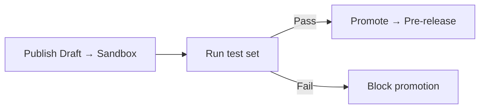

Test runs are most useful when they gate deployments. The [Agents API](/api-reference/agents/introduction) gives you publish and promote actions you can chain behind a passing test set.

## Gate promotions on test results

A typical CI job [publishes](/api-reference/agents/endpoint/deployments/publish-the-current-draft-to-an-environment) the current draft to Sandbox, runs the relevant test set, and only [promotes](/api-reference/agents/endpoint/deployments/promote-a-deployment-to-the-next-environment) to Pre-release if the set passes.

Use the [Deployments endpoints](/api-reference/agents/endpoint/deployments/publish-the-current-draft-to-an-environment) to wire this into your CI pipeline.

## Related pages

<CardGroup cols={2}>
  <Card title="Simulation tests" icon="flask-vial" href="/testing/simulation-tests">
    Author the test cases that CI runs.
  </Card>
  <Card title="Run and review" icon="play" href="/testing/run-and-review">
    Organize tests into sets for CI.
  </Card>
  <Card title="Environments" icon="server" href="/environments-and-versions/introduction">
    How versions move through Sandbox, Pre-release, and Live.
  </Card>
  <Card title="Deployments API" icon="square-terminal" href="/api-reference/agents/endpoint/deployments/publish-the-current-draft-to-an-environment">
    Publish, promote, and rollback endpoints.
  </Card>
</CardGroup>
