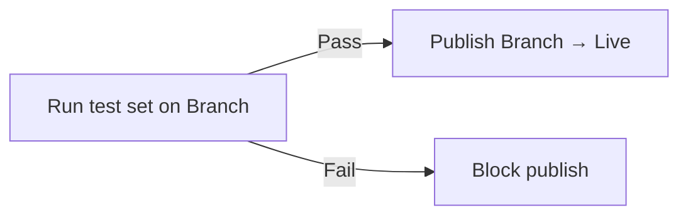

Test runs are most useful when they gate what reaches Live. The [Agents API](/api-reference/agents/introduction) lets you publish only after a test set passes. On the new deployment system, merging a Branch into `main` publishes it to Live.

## Gate publishing on test results

A typical CI job runs the relevant test set on a Branch. If the set passes, the job [merges the Branch into `main`](/api-reference/agents/endpoint/branches/merge-branch), which publishes it to Live. If the set fails, the Branch stays where it is and Live is unaffected.

```mermaid
flowchart LR
    A[Run test set on Branch] -->|Pass| B[Publish Branch → Live]
    A -->|Fail| C[Block publish]
```

Use the [Merge branch](/api-reference/agents/endpoint/branches/merge-branch) and [Rollback](/api-reference/agents/endpoint/deployments/rollback-to-a-previous-deployment) endpoints to wire this into your CI pipeline.

## Related pages

<CardGroup cols={2}>
  <Card title="Simulation tests" icon="flask-vial" href="/testing/simulation-tests">
    Author the test cases that CI runs.
  </Card>
  <Card title="Run and review" icon="play" href="/testing/run-and-review">
    Organize tests into sets for CI.
  </Card>
  <Card title="Environments" icon="server" href="/environments-and-versions/introduction">
    How changes move from a Branch to Live, with Staging optional.
  </Card>
  <Card title="Deployments API" icon="square-terminal" href="/api-reference/agents/endpoint/deployments/rollback-to-a-previous-deployment">
    Rollback and other deployment endpoints.
  </Card>
</CardGroup>
