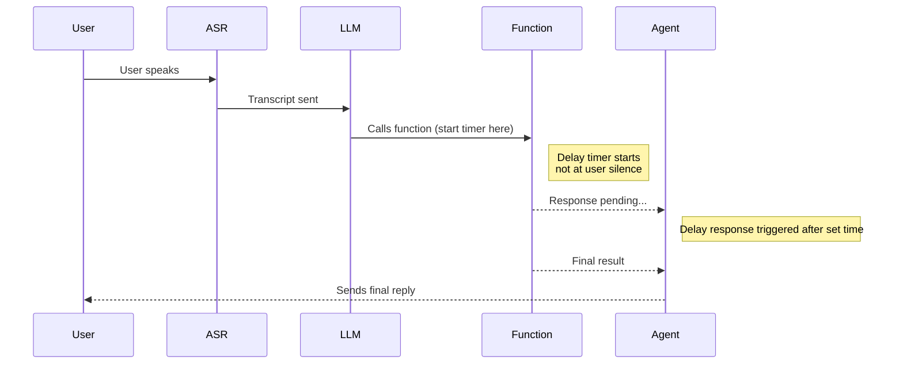

Use the **Delay control** panel to improve user experience when a function takes longer than expected. Transition utterances play while a function is processing, preventing long silences and making interactions feel more natural.

## Key benefits

* **Keep users engaged:** Provide real-time feedback rather than leaving users waiting in silence.
* **Fully configurable timing:** Control when and how often delay responses play.
* **Supports multiple utterances:** Define a sequence of responses to use as interim messages.
* **Works across different function types:** Available for global and flow functions (not supported on start or end functions).

## Important timing behavior

<Tip>
Delay timing does **not** begin from when the user stops speaking. It starts when the **function begins executing** – which can happen seconds later due to LLM, ASR, or model routing latency.
</Tip>

This means that if you set a delay of `1s`, filler utterances may not begin until several seconds after silence, depending on system load and model timing.

<Note>
When setting delays, consider the **full turn latency** – not just the time your function takes to respond. For LLM-heavy flows, use shorter delays like `0–0.5s` or include immediate filler lines directly in the step prompt.
</Note>

## Function timeout

If no delay responses are configured, the function times out after **10 seconds** by default. You can adjust this using the **Timeout after** field in the delay control panel to give longer-running functions more time to complete.

<Warning>
If a function exceeds the configured timeout, execution is terminated. Make sure the timeout value accounts for your function's expected response time under typical load.
</Warning>

## What happens if the caller speaks during delay playback

Delay scripts play on a fixed timer that starts when the function begins executing. If the caller speaks while delay responses are playing, the behavior depends on your [barge-in](/audio-management/introduction#barge-in) configuration:

- **Barge-in enabled:** The agent stops playing the current delay response and listens to the caller. The remaining delay scripts in the queue are discarded. When the function completes, the agent responds to whatever the caller said rather than resuming the delay sequence.
- **Barge-in disabled:** Delay responses continue playing on schedule regardless of caller speech. The caller's input is still captured by ASR but is only processed after the current agent utterance finishes.

<Note>
Barge-in behavior cannot be fully tested in the chat panel. Use a real phone call to verify how your delay responses interact with caller interruptions. See [Audio management](/audio-management/introduction#barge-in) for barge-in configuration.
</Note>

### Functions with side effects

If your function performs external actions (booking an appointment, submitting a form, processing a payment), be aware that barge-in during delay playback can cause the caller to interrupt *after* the function has already executed. The caller may not hear the confirmation, but the action still completes.

For functions with important side effects, consider:
- Disabling barge-in on the specific flow or step using [flow overrides](/audio-management/introduction#barge-in)
- Returning a deterministic `utterance` in the function response to ensure the confirmation is spoken

## Delay control vs. filler utterances

Delay control and global filler utterances are two distinct systems that can run **simultaneously**. Understanding the difference is important to avoid unexpected interleaving of utterances during a call.

| | Delay control | Filler utterances |
| --- | --- | --- |
| **Scope** | Function-scoped – only applies to the specific function where configured | Turn-scoped – catches latency anywhere in the model turn |
| **Trigger** | Fires based on the delay timing set on an individual function | Fires based on global filler utterance configuration |
| **Coverage** | Handles latency during a single function execution | Covers latency across the full turn, including multiple consecutive function executions |

<Warning>
Delay control and filler utterances are **not** mutually exclusive. If both are configured, both will fire independently during the same turn. The ordering of utterances depends on each system's configured timing values, and they may interleave.

If you notice unexpected or overlapping utterances during calls, check whether both delay control and global filler utterances are active.
</Warning>

## How it works

1. **Define delay responses**

   * Create a list of phrases the agent can say while waiting for a function to complete.
   * These might include confirmations or status updates.

2. **Configure delay timing**

   * Set the initial delay (in seconds) after function execution begins.
   * Define the interval between each subsequent utterance.

3. **Specify utterance length**

   * For sound-based responses (e.g., typing noises), specify the expected duration to pace playback accurately.

## Example scenario

An appointment booking function takes several seconds to confirm availability:

1. The user asks for an appointment.
2. The agent immediately says: *"Let me check availability for you."*
3. After 0.5s, it plays: *"Just a moment, I'm still checking..."*
4. After another 2s, it plays: *"Thanks for waiting!"*
5. Once complete, the agent returns: *"Your appointment is booked!"*

## Creating a new delay control phrase

* Go to **Build > Tools** and select a function.
* Open the **Delay control** panel.
* Add one or more delay responses.
* Set the initial delay and interval.
* Optionally, specify the length of sound-based utterances.
* Save changes and test via an actual phone call.

<Note>
The chat panel may not accurately replicate delay behavior. Since delay control is designed for voice/phone call latency, always test with a real call to verify timing and utterance ordering.
</Note>

You can reference state variables inside delay responses using the `$` symbol. For example, `Still checking availability at $branch_name...` – the agent substitutes the value automatically.

For **multilingual agents**, avoid hardcoding delay utterances in a single language. Use state variables like `$DELAY_CHECKING` so the utterance resolves to the correct language at runtime. Hardcoded English text will be spoken in English even on non-English calls.

## Best practices

* Keep filler utterances brief and natural – phrases like "Still working on it..." or "Bear with me one moment" help maintain trust.
* Avoid overly repetitive or robotic phrasing.
* Use delay control sparingly: if your function is fast (under 1 second), it likely does not need filler responses. Adding delay control to near-instant functions can cause over-triggering, where utterances play unnecessarily.
* To prevent over-triggering on functions with variable latency, increase `interval_sec` or set a higher `initial_interval_sec` so utterances only fire when the function is genuinely slow.
* For very slow flows, consider adding initial speech directly in the step prompt and letting the delay control handle the fallback.
* Custom sound effects (e.g., typing sounds) require additional setup. Contact your PolyAI representative to enable custom audio for your project.

<Note>
This feature is ideal for **API-based functions** and **LLM utility functions** that experience irregular latency.
It's **not** suitable for conversational steps where the function is near-instant or where multiple branches could be chosen. For near-instant functions, delay utterances will fire unnecessarily – causing a worse user experience than silence.
</Note>

## Timeline diagram

## Related pages

<CardGroup cols={3}>
  <Card title="Return values" icon="reply" href="/tools/return-values">
    Full reference for return types, including utterance.
  </Card>
  <Card title="Audio management" icon="headphones" href="/audio-management/introduction">
    Configure interaction style and barge-in settings.
  </Card>
  <Card title="Start function" icon="play" href="/tools/start-function">
    Delay control is not supported on start functions – plan accordingly.
  </Card>
</CardGroup>
