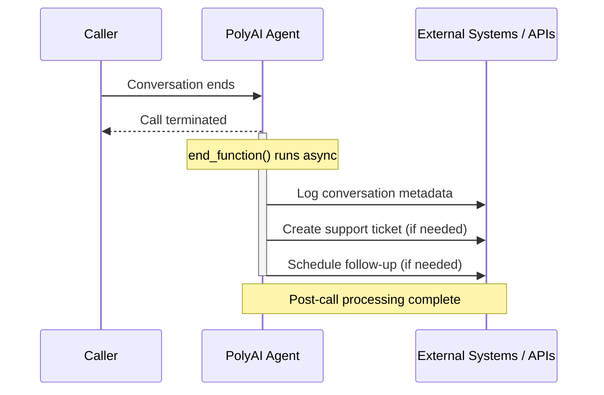

**This page requires Python familiarity.** The end tool is a Python function named `end_function` that runs after every call.

The **End tool** (Python identifier: `end_function`) runs at the end of a conversation for final data processing, cleanup, and integration tasks. Because it runs asynchronously after the call has ended, you can perform complex operations – API calls, summaries, CRM writes – without affecting the caller experience.

`end_function` runs on every completed call. If it writes to external systems (CRM updates, ticket creation, data exports), errors or bugs can silently corrupt downstream data across all calls. Test changes in Sandbox before promoting.

Everything stored on `conv.state` during the call is fully available in `end_function`. This is the core mechanism that makes it useful: any data your tools collected or computed mid-call can be read, transformed, and sent to external systems after the conversation is over.



## Key features and functionality

1. **Asynchronous execution**: Runs after the conversation ends, so it does not delay the call.

2. **Post-conversation data handling**: Captures and processes important details from the conversation for reporting, logging, or integration.

3. **External integrations**: Call APIs, create tickets, or trigger follow-up workflows from the end tool.

## Use cases

The end tool:

### 1. Generates a structured call summary

The most common end-tool pattern is generating a structured summary from `conv.state` at the end of the conversation. This is especially valuable for voice agents where human agents need a written record of what was discussed.

* **Example use case**: Compile caller intent, topics discussed, and resolution status into a summary and push it to your CRM or ticketing system.

### 2. Logs conversation metadata

* Save key conversation details, such as duration, topic, or sentiment analysis, to a database or CRM.

* **Example use case**: Track customer service interactions for reporting and performance analysis.

### 3. Triggers workflows

* Start processes like creating support tickets, sending confirmation emails, or updating account records.

* **Example use case**: Automatically notify the sales team about potential leads from the conversation.

### 4. Schedules follow-ups

* Prepare reminders, SMS notifications, or callbacks for unresolved queries.

* **Example use case**: Send a confirmation SMS after booking an appointment or a callback request.

### 5. Logs outbound call dispositions

The end tool is not limited to inbound voice. Outbound agents use it to log call dispositions, update lead records, and trigger follow-up sequences after each call.

* **Example use case**: After an outbound sales call, update the lead status in your CRM and queue a follow-up email if the prospect requested more information.

## Implementation example

Below is a Python implementation of the end tool. The function must be named `end_function`:

```python
def end_function(conv: Conversation):
    try:
        # Generate a structured call summary from conv.state
        summary = {
            "conversation_id": conv.id,
            "topic": conv.state.get("last_topic", "Unknown"),
            "sentiment": conv.state.get("sentiment", "Neutral"),
            "resolution": conv.state.get("resolution_status", "Unresolved"),
        }
        log_to_crm(summary)

        # Trigger external API
        if conv.state.get("support_needed"):
            create_support_ticket(conv.state.get("user_id"), summary)

        # Schedule follow-up if necessary
        if conv.state.get("follow_up_required"):
            schedule_follow_up(
                conv.state.get("user_id"),
                conv.state.get("follow_up_time"),
            )
    except Exception as e:
        # Errors are silent to the caller – log externally so they aren't lost
        log_error_to_monitoring_service(e)
```

`end_function`'s return value is not used by the runtime. You do not need to return anything.

## Best practices for end-tool design

<Warning>
**Critical:** Errors in `end_function` do not surface to the caller (the call is already over), but they can silently break downstream workflows. Always implement thorough error handling with try/except blocks and external logging, as shown in the example above. Test changes in Sandbox before deploying to production.
</Warning>

1. **Efficient execution**:

   * Design `end_function` to complete quickly. Parallelize independent API calls where possible, avoid unnecessary data fetching, and keep heavy computation outside the critical path.

2. **Error handling**:

   * Wrap the `end_function` body in a `try/except` block and log errors to an external monitoring service. Without this, failures are completely invisible.

3. **Data consistency**:

   * Validate and sanitize data collected during the conversation before processing or logging it.

4. **Relevance**:

   * Include only necessary post-conversation tasks to maintain efficiency and focus.

## Examples: Enhancing post-conversation workflows

### Data logging for analytics

Capture details like customer sentiment, topics discussed, and the resolution status for reporting and analytics.

**Example:**

* "Logged: Customer expressed interest in our premium plan and showed positive sentiment."

### Automatic follow-ups

Send reminders, confirmation messages, or escalation notices to keep the customer informed.

**Example:**

* "An email has been sent confirming your booking for January 10th."

### Task automation

Trigger external workflows or integrations.

**Example:**

* "Support ticket created: Issue with account login noted during the conversation."

### CRM updates

Ensure customer records are up to date with the latest interaction details.

## Related pages

<CardGroup cols={3}>
  <Card title="Start tool" icon="play" href="/tools/start-tool">
    Initialize conversation context before the greeting plays.
  </Card>
  <Card title="Surveys (CSAT)" icon="star-half-stroke" href="/analytics/csat/introduction">
    Trigger post-call satisfaction surveys from the end tool.
  </Card>
  <Card title="conv object" icon="code" href="/tools/classes/conv-object">
    Access conv.state and other data in end_function.
  </Card>
</CardGroup>
