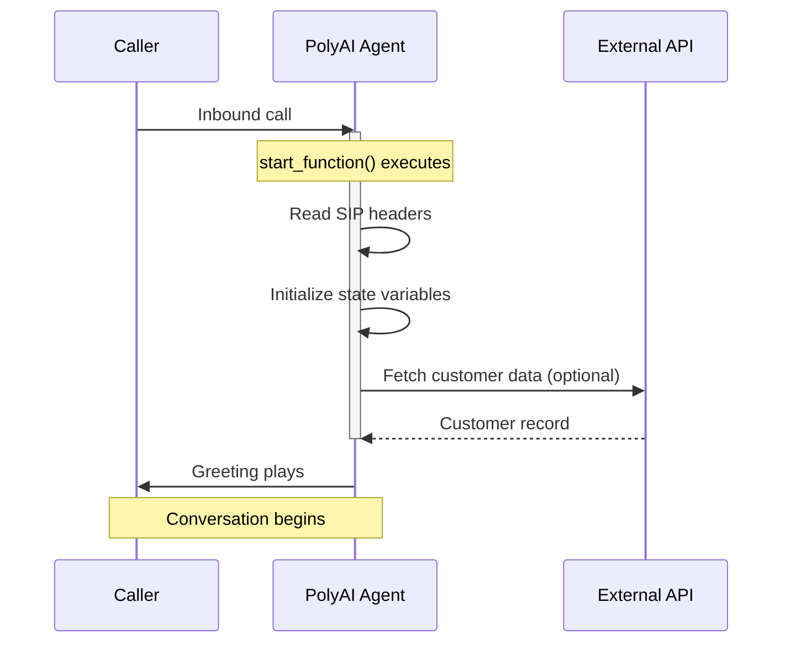

**This page requires Python familiarity.** The start tool is a Python function named `start_function` that runs before every call's greeting.

The **Start tool** (Python identifier: `start_function`) runs when a conversation begins, before the greeting plays. Use it to initialize conversation state, read SIP headers, or make API calls. A broken or slow `start_function` delays or prevents the greeting from playing, affecting every inbound call.



<Warning>
The start tool is **synchronous** – `start_function` must complete before the greeting plays. If it times out, the greeting may not play correctly, and the conversation may enter an unexpected state. Keep execution fast to avoid issues.

**For outbound agents**: if the recipient answers and hangs up before `start_function` completes, it may be skipped entirely. Design your outbound start tools to handle this gracefully.
</Warning>

[Delay control](/tools/delay-control) (filler utterances) is **not supported** on the start tool. If `start_function` has variable latency, the only mitigation is to keep it fast or move slow operations into a flow step.

### When to use the start tool vs. a flow step

Not every API call belongs in the start tool. Use this decision framework:

| Scenario | Where to place it |
|----------|------------------|
| Data needed **before** the greeting (e.g. caller lookup for a personalized greeting) | Start tool |
| Fast, reliable API (&lt;1s response time) | Start tool – reduces mid-conversation latency |
| Slow or unreliable API (external CRM, third-party lookup) | First [flow step](/flows/introduction) – protects the greeting |
| Data only needed mid-conversation | Flow step |

If an API call is not strictly needed before the greeting, move it to the first step of your flow to avoid timeout risk.

## Key features

- **Synchronous execution**: Completes before the greeting plays
- **Context preparation**: Stores data for use throughout the conversation

## Use cases

<AccordionGroup>
  <Accordion title="Detect channel type" icon="display">
    Use [`conv.channel_type`](/tools/classes/conv-object#channel_type) to determine whether the conversation is voice, webchat, or another channel – then branch accordingly. Disable call transfers for webchat, set a different persona, or inject channel-specific prompts.
  </Accordion>
  <Accordion title="Read connection metadata" icon="signal">
    Capture SIP headers (voice) or URL parameters (webchat) to determine the caller's origin – for example, mapping a dialled number to a business branch.
  </Accordion>
  <Accordion title="Retrieve date and time" icon="clock">
    Initialize state with the current date, time, or day of the week for timestamping or scheduling logic.
  </Accordion>
  <Accordion title="Make API calls" icon="globe">
    Fetch external data such as user preferences, account information, or customer records to preload personalized context.
  </Accordion>
  <Accordion title="Set the active variant" icon="location-dot">
    Use [`conv.set_variant()`](/tools/classes/conv-object#set_variant) to route the conversation to a specific [variant](/variant-management/introduction) based on SIP headers, callee number, or other metadata. This is the standard way to configure multi-site agents.
  </Accordion>
  <Accordion title="Detect language and branch" icon="language">
    Read a language header or parameter and configure the agent accordingly – set the variant, choose a language-specific TTS voice, or store language-specific prompt rules in state.
  </Accordion>
  <Accordion title="Read outbound call metadata" icon="phone-arrow-up-right">
    For outbound agents, read lead data or campaign metadata from SIP headers injected by the calling platform.
  </Accordion>
  <Accordion title="Read integration attributes" icon="plug">
    Access [`conv.integration_attributes`](/tools/classes/conv-object#integration_attributes) to read metadata passed from external integrations (e.g. DNIs pooling, Chat API).

    <Note>`conv.integration_attributes` can only be read in `start_function`. Extract values and store them in `conv.state` for use later.</Note>
  </Accordion>
  <Accordion title="Configure a TTS provider" icon="microphone">
    Set the TTS provider in `start_function`. Supported providers include [Cartesia](https://docs.cartesia.ai/api-reference/tts/tts), [PlayHT](https://docs.play.ht/reference/api-getting-started), and [Rime](https://docs.rime.ai/api-reference/voices). See [voice configuration](/voice/voice-configuration) and [tool classes](/tools/classes).
  </Accordion>
</AccordionGroup>

## Implementation example

Below is a Python implementation of the start tool. The function must be named `start_function`:

```python
import datetime as dt

def start_function(conv: Conversation):
    # Retrieve the current date and time
    now = dt.datetime.now()
    conv.state.current_date = now.strftime("%A %d-%m-%Y")
    conv.state.current_weekday = now.strftime("%A")
    conv.state.current_time = now.strftime("%H:%M")

    # Initialize state variables
    conv.state.available_times = None
    conv.state.user_bookings = None

    # Store the caller's phone number
    conv.state.phone_number = conv.caller_number

    # Detect channel type for multi-channel agents
    conv.state.is_voice = conv.channel_type == "sip.polyai"

    # Set variant based on dialled number (multi-site routing)
    site_map = {
        "+441234567890": "london",
        "+442345678901": "new_york",
    }
    site = site_map.get(conv.callee_number, "default")
    conv.set_variant(site)

    # Store integration attributes (only available in start_function)
    if conv.integration_attributes:
        conv.state.shared_id = conv.integration_attributes.get("shared_id")

    # Return an empty string to indicate successful execution
    return str()
```

## Return values

The start tool supports the same [return values](/tools/return-values) as other tools. The most common patterns are:

### Empty string (default)

Return `str()` when `start_function` only needs to set up state. The agent greeting defined in the Agent settings will play as normal.

```python
return str()
```

### Dynamic greeting

Return an `utterance` to override the default greeting with a dynamically generated message. This is useful when the greeting depends on data fetched during `start_function` (e.g. the caller's name or site-specific wording).

```python
return {
    "utterance": f"Welcome to {conv.variant.site_name}. How can I help you today?"
}
```

<Warning>
Returning an `utterance` from `start_function` overrides the Agent Greeting field. If you use both, test carefully to ensure the correct greeting plays.
</Warning>

### Listen configuration

Return a `listen` object to configure ASR behavior for the first turn.

```python
return {
    "utterance": "Welcome. Please say or enter your account number.",
    "listen": {
        "asr": {
            "timeout": 15
        }
    }
}
```

See [return values](/tools/return-values) for the full list of supported return types.

## Best practices

1. **Keep it fast**: The start tool blocks the greeting. Target under 1 second total execution time. Move slow or unreliable API calls to a [flow step](/flows/introduction).

2. **Never hardcode credentials**: Use [`conv.utils.get_secret()`](/secrets/introduction) for all API keys, tokens, and passwords. Hardcoded credentials in tool code are a security risk and may be exposed in logs or version history.

   ```python
   api_key = conv.utils.get_secret("my_api_key")
   ```

3. **Error handling**:

   * Handle missing or malformed data and avoid runtime errors.

   * Provide fallbacks for incomplete or invalid information (like missing SIP headers or unavailable APIs).

4. **State initialization**:

   * Predefine and initialize all state variables needed for the conversation to avoid undefined behaviors. Reading an unset `conv.state` variable returns `None` (it does not raise), so initializing to `None` – or a sensible default like `""` or `0` – makes intent explicit and keeps [prompt templates](/tools/variables#prompt-templating) and `is None` checks predictable.

     ```python
     conv.state.booking_time = None   # explicit "not yet collected" marker
     conv.state.ooh_preface = ""      # safe default for prompt templating
     ```

   * Extract `conv.integration_attributes` here – they are only available in `start_function`.

5. **Contextual relevance**:

   * Only include setup steps that are directly relevant to the conversation's purpose.

   * Avoid overloading the start tool with unnecessary logic.

## Common patterns

<AccordionGroup>
  <Accordion title="Multi-site variant routing">
    The most common advanced use of the start tool is routing to a [variant](/variant-management/introduction) based on the dialled number, SIP headers, or other metadata. This is how multi-site agents (hotels, restaurant chains, retail) determine which location's content to use.

    **Hardcoded map** – use when the number-to-variant mapping is small and static:

    ```python
    def start_function(conv: Conversation):
        phone_numbers = {
            "+441234567890": "London",
            "+442345678901": "New York",
        }
        conv.set_variant(phone_numbers.get(conv.callee_number, "default"))
        return str()
    ```

    **Dynamic lookup from variant attributes** – use when you store the phone number (or any routing key) as an attribute in the variant table. For example, if your variant table has a `callee` column containing each variant's phone number:

    ```python
    def start_function(conv: Conversation):
        callee_map = {
            variant.callee: variant_name
            for variant_name, variant in conv.variants.items()
        }
        if conv.callee_number and conv.callee_number in callee_map:
            conv.set_variant(callee_map[conv.callee_number])
        return str()
    ```

    Replace `variant.callee` with whatever attribute name you defined in **Build > Variant management** (e.g., `variant.phone_number`, `variant.routing_id`).

    **Full article:** [Variant management](/variant-management/introduction)
  </Accordion>

  <Accordion title="Language detection and branching">
    Read a language code from SIP headers or integration data, set the appropriate variant, and configure a language-specific TTS voice.

    ```python
    def start_function(conv: Conversation):
        language = conv.sip_headers.get("X-Language", "en")
        conv.set_variant(language)

        if language == "es":
            from polyai.voice import CartesiaVoice
            conv.set_voice(CartesiaVoice(provider_voice_id="your-voice-id"))
        return str()
    ```

    **Force a language by dialled number (DNIS)** – use `conv.callee_number` and `conv.set_language()` when each market has its own phone number and you want to skip auto-detection. The language code must already be configured under **Configure > General > Additional languages** (or be the main language); otherwise the agent falls back to the default language.

    ```python
    def start_function(conv: Conversation):
        spanish_dnis = {"+34911234567", "+34931234567"}

        if conv.callee_number in spanish_dnis:
            conv.set_language("es-ES")
        else:
            conv.set_language("en-US")
        return str()
    ```

    See [Multi-language](/agent-settings/multilingual) for the full setup.
  </Accordion>

  <Accordion title="Channel-type branching">
    Use `conv.channel_type` to disable voice-only features (like call transfers) for webchat, or to inject channel-specific prompts.

    ```python
    def start_function(conv: Conversation):
        conv.state.is_voice = conv.channel_type == "sip.polyai"
        if not conv.state.is_voice:
            conv.state.transfers_enabled = False
        return str()
    ```
  </Accordion>

  <Accordion title="Multi-voice configuration">
    The start tool is where you configure which TTS voice the agent uses for a given call. This is required when running multiple voices across variants or channels, because the Voice page UI may not expose all available providers.

    **Full article:** [Multi-voice](/voice/multi-voice)
  </Accordion>

  <Accordion title="Dynamic user identification">
    Use `conv.caller_number` or metadata from an API call to personalize the greeting or preload account context.
  </Accordion>

  <Accordion title="Preloading context">
    Make a fast API call to fetch scheduling information, past bookings, or account details so the agent has context from the first turn.
  </Accordion>
</AccordionGroup>

## Related pages

<CardGroup cols={3}>
  <Card title="End tool" icon="stop" href="/tools/end-tool">
    Run post-call processing after a conversation ends.
  </Card>
  <Card title="Return values" icon="reply" href="/tools/return-values">
    Control agent behavior with string and dictionary returns.
  </Card>
  <Card title="Variant management" icon="code-branch" href="/variant-management/introduction">
    Route calls to specific variants from the start tool.
  </Card>
</CardGroup>
